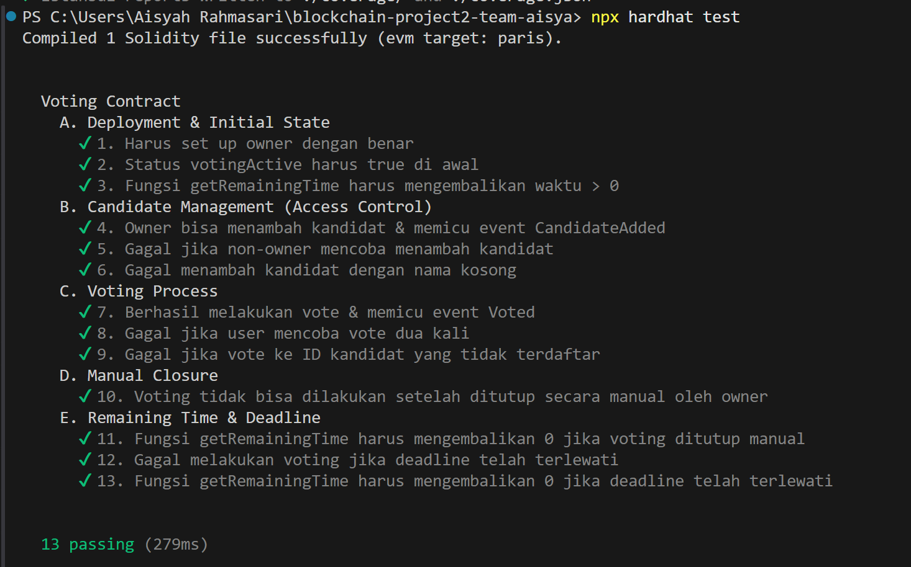
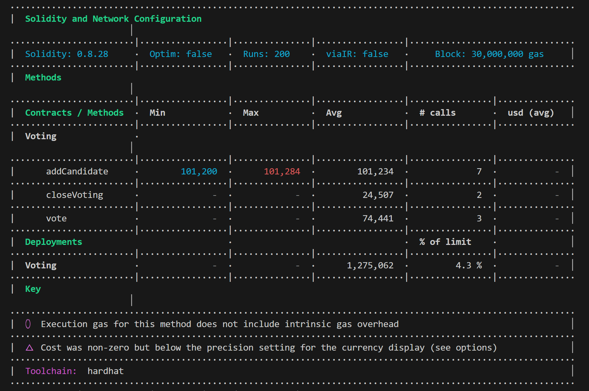
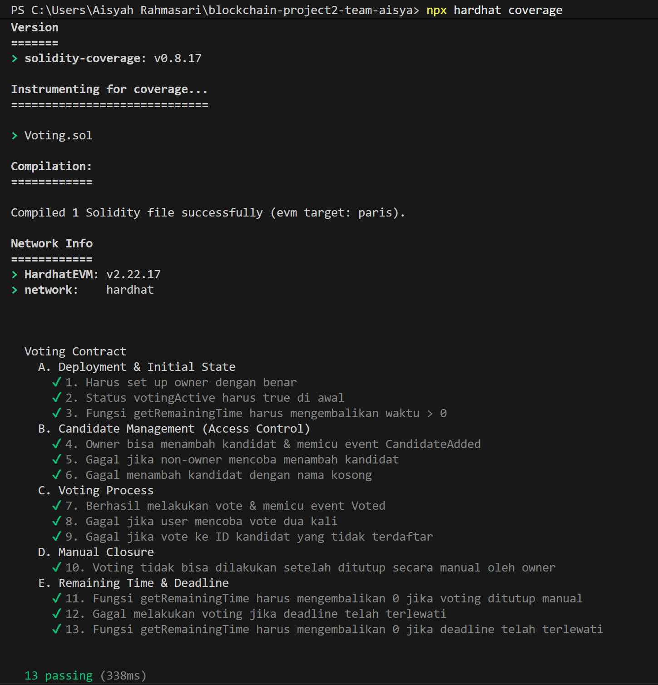
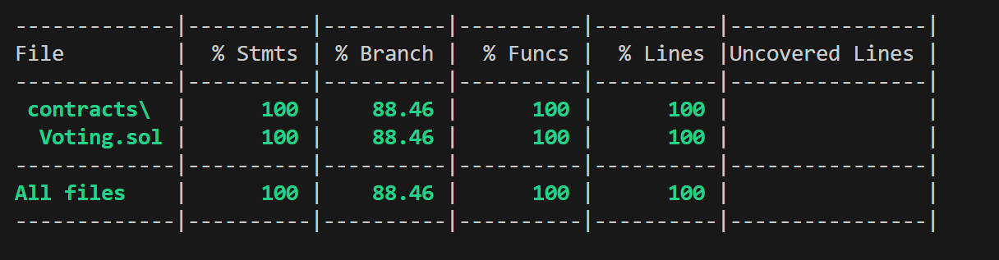
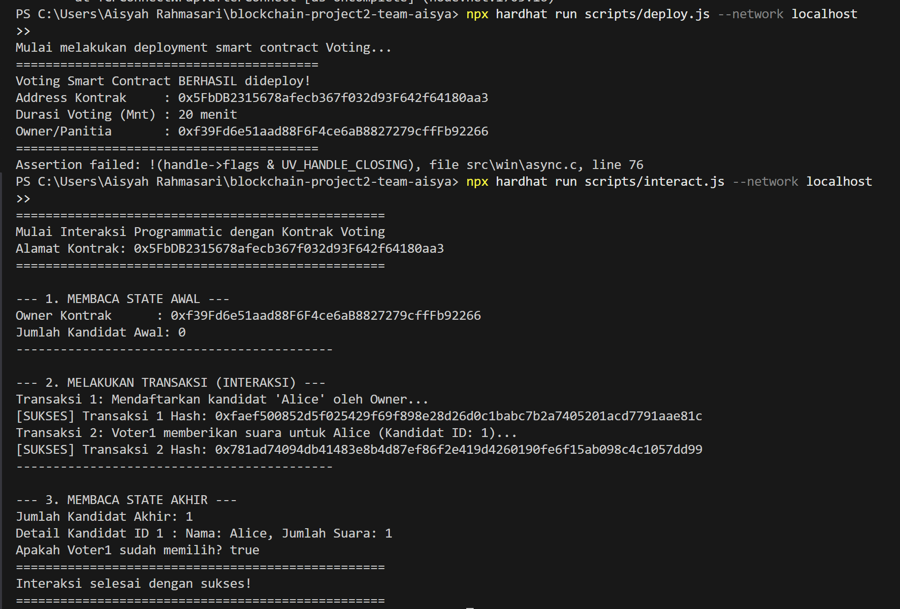
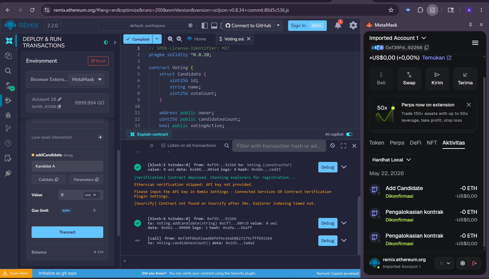
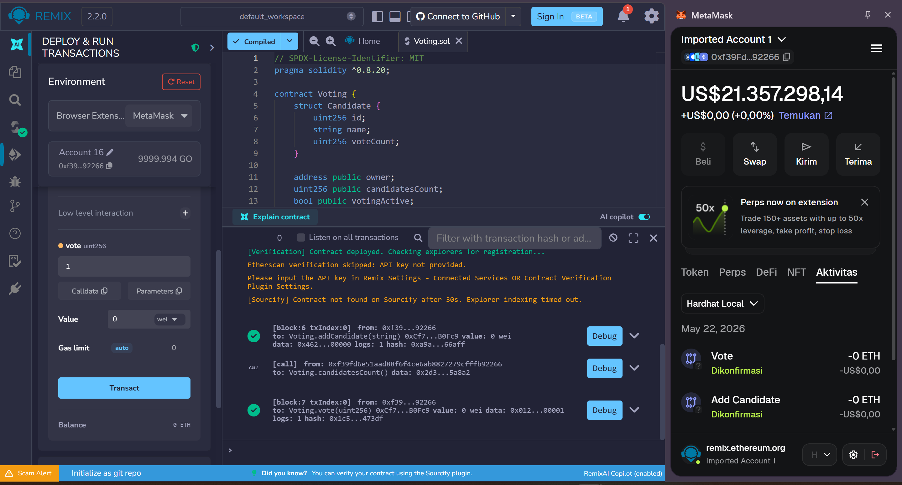
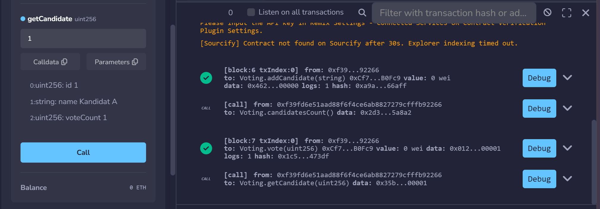

# Simple Voting Smart Contract (Project 2)

## Deskripsi Proyek
Proyek ini adalah implementasi **Smart Contract Voting Sederhana** yang berjalan di atas jaringan Ethereum (EVM). Sistem ini dirancang untuk menyediakan kotak suara digital yang transparan, terdesentralisasi, aman, dan anti-manipulasi. 

Sistem ini memastikan bahwa setiap pemilih hanya dapat memberikan satu suara secara unik menggunakan identitas dompet Web3 mereka (MetaMask) tanpa perlu menggunakan sistem database eksternal terpusat. Proyek ini dibangun menggunakan framework **Solidity** dan **Hardhat** versi 2.

| Name                          | NRP                              | Role        |
|-------------------------------|-----------------------------------|------------|
| Fadlillah Cantika Sari Hermawan     | 5027231042             | Orang Pertama-Smart Contract Developer |
|   Callista Meyra Azizah |   5027231060 | Orang Kedua-QA / Unit Tester |
|      Aisyah Rahmasari      |   5027231072                |  Orang Ketiga-Deployment & Dokumentasi  |


## Fitur Smart Contract
### Fitur Wajib (Mandatory):
*   **Registrasi Kandidat:** Owner (panitia) dapat mendaftarkan nama-nama kandidat secara dinamis.
*   **Sistem Satu Suara (One Vote per Wallet):** Menjamin setiap alamat dompet hanya bisa memilih sekali (mencegah *double voting*).
*   **Pencatatan Hasil:** Hasil voting tersimpan aman di blockchain dan dapat dilihat secara transparan oleh siapa saja.
*   **Event Log:** Memicu sinyal event (`CandidateAdded`, `Voted`, `VotingClosed`) untuk kebutuhan pelacakan riwayat transaksi.

### Fitur Bonus (Implemented):
*   **Dinamis & Bebas Hardcode:** Durasi voting ditentukan secara dinamis dalam hitungan menit saat proses *deployment*.
*   **Voting Deadline (Batas Waktu Otomatis):** Voting otomatis tertutup secara sistem sistemis jika waktu blockchain (`block.timestamp`) telah melewati batas waktu yang ditentukan.
*   **Fungsi Sisa Waktu:** Menyediakan fungsi eksternal (`getRemainingTime`) untuk memeriksa sisa durasi pemilihan secara transparan.

## Spesifikasi Teknis Smart Contract (`Voting.sol`)
Kontrak ini telah dirancang untuk memenuhi seluruh persyaratan minimum tugas:

| Komponen Teknis | Batas Minimum Tugas | Implementasi di `Voting.sol` | Status |
| :--- | :--- | :--- | :--- |
| **State Variables** | Minimal 3 | 4: `owner`, `candidatesCount`, `votingActive`, `votingDeadline` | **Terpenuhi** |
| **Mappings** | Minimal 1 | 2: `candidates` (ID ke data) dan `hasVoted` (status pemilih) | **Terpenuhi** |
| **Modifiers** | Minimal 1 | 2: `onlyOwner` (hak akses) dan `isVotingActive` (penjaga waktu) | **Terpenuhi** |
| **Events** | Minimal 2 | 3: `CandidateAdded`, `Voted`, `VotingClosed` | **Terpenuhi** |
| **Functions** | Minimal 4 | 5: `addCandidate`, `vote`, `closeVoting`, `getCandidate`, `getRemainingTime` | **Terpenuhi** |

## Panduan Cara Menjalankan Proyek
### 1. Prasyarat Sistem (Prerequisites)
Pastikan komputer Anda sudah terinstal:
*   Node.js v22.13.0 atau versi di atasnya.
*   npm v10.5.2 atau versi di atasnya.
### 2. Clone Project
### 3. Instalasi Dependensi
```
npm install --legacy-peer-deps
```
### 4. Kompilasi File Kontrak Voting.sol
Lakukan kompilasi smart contract Solidity menggunakan perintah berikut:
```bash
npx hardhat compile
```

### 5. Jalankan Unit Testing & Analisis Estimasi Gas (Hasil Gambar 1 & 2)
Untuk memproses 13 skenario kasus uji otomatis sekaligus memicu modul laporan statistik penggunaan gas:
```bash
npx hardhat test
```

### 6. Jalankan Uji Cakupan Kode / Test Coverage (Hasil Gambar 3 & 4)
Untuk menghitung persentase baris kode dan percabangan keputusan (*branches*) yang tereksekusi oleh unit test:
```bash
npx hardhat coverage
```

### 7. Jalankan Node Jaringan Blockchain Lokal (Local Node)
Nyalakan node simulasi blockchain lokal Hardhat pada jendela terminal pertama Anda:
```bash
npx hardhat node
```

### 8. Lakukan Deployment & Interaksi Programmatic (Hasil Gambar 5)
Buka jendela terminal kedua Anda, kemudian jalankan berkas skrip deployment dan simulasi interaksi secara terprogram pada jaringan lokal tersebut:
```bash
# Eksekusi deployment kontrak ke localhost
npx hardhat run scripts/deploy.js --network localhost

# Eksekusi skrip interaksi programmatic (pendaftaran kandidat & voting)
npx hardhat run scripts/interact.js --network localhost
```


## Hasil Pengujian & Eksekusi Jaringan Lokal

### 1. Kompilasi & Unit Testing (Hardhat Test)
Seluruh fungsionalitas smart contract telah diuji secara menyeluruh dengan **13 unit test cases** mencakup pengujian fungsional (*positive/negative*), kontrol akses (*access control*), trigger event log, dan manipulasi waktu blockchain (*deadline/remaining time*).

Berikut adalah rincian skenario kasus uji (*test cases*) yang telah berhasil dilewati:
*   **A. Deployment & Initial State:**
    1.  *Harus set up owner dengan benar:* Memastikan panitia pendeploy dicatat secara sah sebagai pemilik/owner kontrak.
    2.  *Status votingActive harus true di awal:* Memastikan gerbang pemilihan otomatis terbuka segera setelah kontrak ter-deploy.
    3.  *Fungsi getRemainingTime harus mengembalikan waktu > 0:* Memastikan waktu sisa durasi awal dihitung dengan tepat sesuai durasi awal.
*   **B. Candidate Management (Access Control):**
    4.  *Owner bisa menambah kandidat:* Memastikan fungsi `addCandidate` sukses menyimpan nama kandidat dan memicu event log `CandidateAdded`.
    5.  *Gagal jika non-owner mencoba mendaftarkan kandidat:* Menguji proteksi modifier `onlyOwner` agar panitia gadungan diblokir.
    6.  *Gagal menambah kandidat dengan nama kosong:* Menguji proteksi validasi string input agar nama kandidat tidak boleh kosong.
*   **C. Voting Process:**
    7.  *Berhasil melakukan vote:* Pemilih sah dapat memberikan suara untuk kandidat ID 1 dan memicu event log `Voted`.
    8.  *Gagal jika user mencoba vote dua kali:* Menguji keandalan penanda mapping `hasVoted` untuk memblokir kecurangan *double voting*.
    9.  *Gagal jika vote ke ID kandidat yang tidak terdaftar:* Memastikan pemilih tidak memilih kandidat fiktif.
*   **D. Manual Closure:**
    10. *Voting tidak bisa dilakukan setelah ditutup manual:* Menguji keandalan fungsi darurat `closeVoting` yang mematikan keaktifan voting sebelum deadline terlewati.
*   **E. Remaining Time & Deadline:**
    11. *getRemainingTime bernilai 0 jika ditutup manual:* Sisa waktu otomatis ter-reset menjadi 0 saat voting ditutup paksa.
    12. *Gagal melakukan voting jika deadline telah terlewati:* Menguji proteksi modifier waktu agar tidak ada suara yang bisa masuk setelah waktu habis.
    13. *getRemainingTime bernilai 0 jika deadline telah terlewati:* Sisa waktu otomatis ter-reset menjadi 0 saat waktu habis.


*Gambar 1: Output Terminal npx hardhat test (13 passing).*

---

#### Analisis Konsumsi Gas (Gas Consumption Analysis)
Kami juga mengintegrasikan modul `hardhat-gas-reporter` untuk mengukur konsumsi gas Ethereum pada setiap metode untuk memastikan efisiensi kode dan meminimalkan biaya transaksi:
*   Metode `addCandidate` membutuhkan rata-rata **101.234 gas**.
*   Metode `vote` membutuhkan rata-rata **74.441 gas**.
*   Deployment kontrak `Voting` membutuhkan biaya pembuatan awal sebesar **1.275.062 gas** (hanya memakai 4.3% dari batas kapasitas blok EVM, sangat hemat!).


*Gambar 2: Hasil Analisis Penggunaan Gas Metode Smart Contract.*

---

#### Cakupan Kode Pengujian (Test Coverage)
Kekuatan pengujian diverifikasi menggunakan `solidity-coverage` untuk memastikan seluruh baris kode dan percabangan keputusan (*branches*) diuji dengan andal:


*Gambar 3: Log Eksekusi solidity-coverage.*


*Gambar 4: Persentase Coverage Hasil Pengujian (100% Statements, 88.46% Branches, 100% Functions, 100% Lines).*

Tingkat cakupan kode berhasil mencatatkan **100% untuk Statements, Functions, dan Lines, serta 88.46% untuk Branch Coverage** (sangat jauh di atas batas kelulusan minimum tugas sebesar 80%).

---

### 2. Hasil Deployment & Interaksi Programmatic Lokal
Proses deployment secara otomatis dan pengujian interaksi transaksional blockchain menggunakan Node.js script berhasil diselesaikan:


*Gambar 5: Log Terminal Eksekusi Skrip deploy.js dan interact.js secara berurutan.*

*   **Address Kontrak Ter-deploy:** `0x5FbDB2315678afecb367f032d93F642f64180aa3`
*   **Hasil Interaksi:** Skrip `interact.js` sukses mendaftarkan kandidat `"Alice"`, memproses hak suara pemilih pertama (`Voter1`), serta memverifikasi perubahan state akhir (jumlah kandidat = 1, perolehan suara Alice = 1, status telah memilih = true).

---

### 3. Hasil Integrasi & Demo Dompet MetaMask & Remix IDE (Web3 GUI)
Pengujian interaksi visual menggunakan antarmuka grafis Web3 terdesentralisasi berhasil diselesaikan dengan baik:
*   **Koneksi Jaringan Lokal:** Ekstensi MetaMask sukses terhubung ke jaringan `Hardhat Local` (`http://127.0.0.1:8545`) dengan Chain ID `31337`.
*   **Import Akun:** Meng-import Account #0 (`0xf39Fd6e51aad88F6F4ce6aB8827279cffFb92266`) menggunakan Private Key standar Hardhat, menghasilkan saldo test gratis **9999.998 ETH**.
*   **Deployment & Interaksi Visual (Remix IDE):**
    *   Mendeploy instance kontrak baru dengan durasi aman `1000` menit (`0xCf7156538F21855963a08b7f52c433c29b0c7a40`).
    *   Mendaftarkan kandidat baru bernama `"Kandidat A"` melalui MetaMask (`Add Candidate` confirmed).
    *   Memberikan suara (*voting*) melalui MetaMask (`Vote` confirmed).
    *   Membaca status akhir menggunakan fungsi `getCandidate(1)` yang sukses menampilkan perubahan data (**`voteCount: 1`**).





## Contract Address (Jaringan Lokal)
*   **Contract Address (Hardhat Deploy Script):** `0x5FbDB2315678afecb367f032d93F642f64180aa3`
*   **Contract Address (Remix IDE Deploy):** `0xCf7156538F21855963a08b7f52c433c29b0c7a40` (atau sesuai alamat di Remix Anda)

---

*Laporan akhir ini disusun untuk memenuhi standar kelulusan Penilaian Blockchain Modul 07 s.d. Modul 11.*

### 4. Hasil Integrasi & Demo Frontend dApp via Vercel (Online GUI)

Pengujian interaksi dApp secara online menggunakan antarmuka website React yang telah di-deploy ke Vercel berhasil diselesaikan dengan baik:

*   **Tautan Akses Online (Vercel):** [blockchain-project2-team-aisya.vercelapp](https://blockchain-project2-team-aisya.vercel.app)
*   **Koneksi MetaMask Online:** dApp dapat diakses secara publik dan dihubungkan ke ekstensi MetaMask menggunakan jaringan **Hardhat Localhost** atau **Sepolia Testnet** (blockchain publik).
*   **Interaksi Real-Time (Event Listening):**
    *   Melakukan registrasi kandidat secara visual melalui panel admin.
    *   Melakukan voting pada kandidat pilihan menggunakan MetaMask.
    *   Data perolehan suara kandidat ter-update secara otomatis tanpa refresh halaman berkat fungsionalitas *Real-Time Event Listener* (`contract.on("Voted")`).
    *   Alamat dompet pemilih otomatis tercatat secara real-time ke dalam tabel **Riwayat Aktivitas Voting** di bawah halaman web.

#### Screenshot Pengujian dApp via Vercel:

---

## Contract Address & Live Link

*   **Contract Address (Hardhat Deploy Script):** `0x5FbDB2315678afecb367f032d93F642f64180aa3`
*   **Contract Address (Remix IDE Deploy):** `0xcF7156538F21855963a08b7f52c433c29b0c7a40`
*   **Contract Address (Sepolia Testnet Deploy):** `[alamat kontrak Callista]`
*   **Live dApp URL (Vercel):** `https://blockchain-project2-team-aisya.vercel.app`


